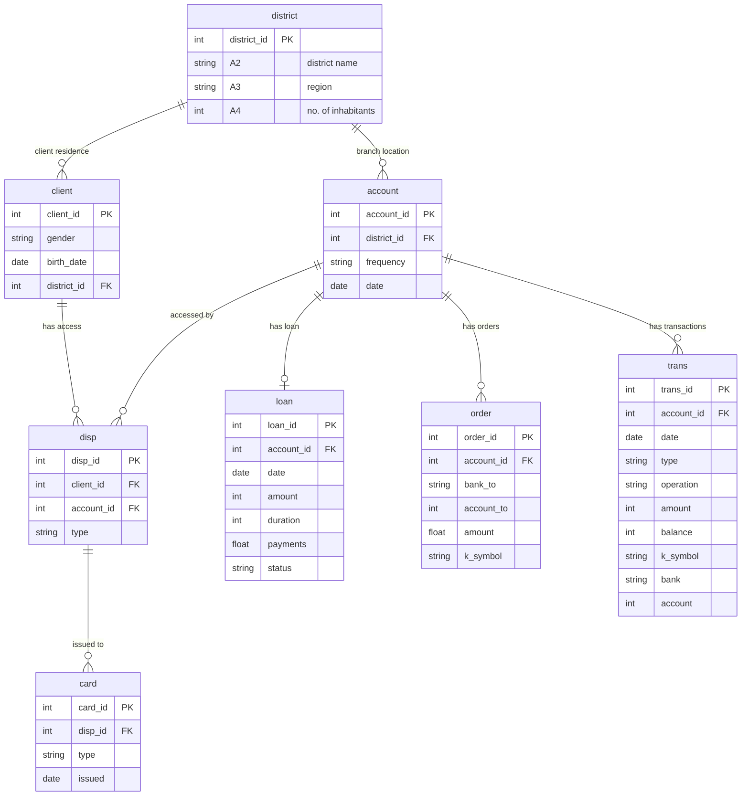

# Loan application

Analysis of the [PKDD'99 Financial dataset](https://relational.fel.cvut.cz/dataset/Financial), a Czech bank dataset containing information about accounts, clients, transactions, and loans.

## Data model

